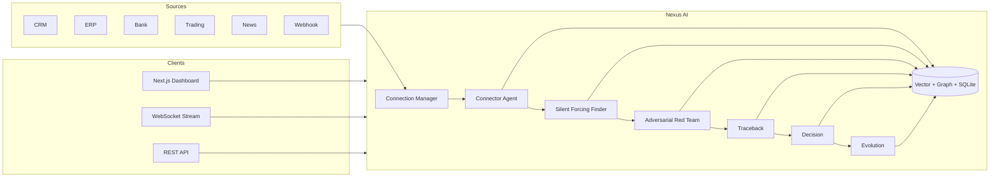

# Nexus AI

**Auditable multi-agent financial intelligence** — unifies CRM, ERP, banking, trading, and news into one pipeline that finds blind spots, stress-tests them adversarially, traces decisions through memory, and learns from outcomes.

[](https://github.com/YOUR_ORG/nexus-ai/actions/workflows/ci.yml)
[](LICENSE)

> **Launch status:** Demo-ready open core (v0.9). JWT + rate limits + WebSocket auth are shipped (optional in demo). Live vendor APIs remain stubs — see [What ships today](#what-ships-today).

---

## Test it now (Windows)

**Prerequisites:** Python **3.11** (recommended), Node **20+**.

```powershell
cd e:\Fluf37   # or your clone path

# 1) Config + demo data
if (-not (Test-Path .env)) { Copy-Item .env.example .env }
python -m venv venv
.\venv\Scripts\Activate.ps1
pip install -r requirements.txt
python scripts/generate_demo_data.py --seed 42

# 2) Backend (terminal 1)
uvicorn backend.main:app --reload --port 8000

# 3) Frontend (terminal 2)
cd frontend
if (-not (Test-Path node_modules)) { npm install }
if (-not (Test-Path .env.local)) { Copy-Item ..\.env.example .env.local }
npm run dev
```

| Step | URL / action |
|------|----------------|
| Open dashboard | http://localhost:3000 |
| Wait for sidebar | **WS: connected** |
| Run demo | Click **Run Pipeline** |
| Verify | Sidebar shows **WS: connected** and pipeline reaches **COMPLETE** |
| Traceback | **Traceback** page shows React Flow graph (failures → loss event) + timeline |
| Decisions | **Decisions** shows loan + trade cards (deduped); **Agents** shows streamed output |
| API docs | http://localhost:8000/docs |

**Automated tests** (from repo root, venv active):

```powershell
python scripts/generate_demo_data.py --seed 42
pytest tests/ -q
python -m ruff check backend tests
cd frontend; npm run type-check; npm run lint; npm run build
```

**Quick API check** (PowerShell, backend running):

```powershell
$h = @{ "X-Nexus-Key" = "demo-key" }
Invoke-RestMethod http://localhost:8000/health
Invoke-RestMethod http://localhost:8000/api/v1/sources/status -Headers $h
Invoke-RestMethod -Method POST http://localhost:8000/api/v1/nexus/run/demo -Headers $h
```

**JWT** (optional; default `AUTH_MODE=jwt_optional`):

```powershell
$token = (Invoke-RestMethod -Method POST http://localhost:8000/api/v1/auth/token -Headers $h).access_token
Invoke-RestMethod http://localhost:8000/api/v1/sources/status -Headers @{ Authorization = "Bearer $token" }
```

Full UI checklist: [docs/demo_checklist.md](docs/demo_checklist.md). One-command backend bootstrap: `.\start_nexus.ps1` (still start frontend separately).

**Troubleshooting:** Use Python 3.11 if `pip install` fails on 3.13 (or use system Python if deps are already installed). Ensure `X-Nexus-Key` matches `NEXUS_API_KEY` in `.env`. If port **8000** fails on Windows (`WinError 10013`), run the API on **8080** and set `NEXT_PUBLIC_API_URL` / `NEXT_PUBLIC_WS_URL` to `http://localhost:8080` and `ws://localhost:8080/ws/nexus/stream` in `frontend/.env.local`, then restart `npm run dev`. **Connections → Connect** requires admin (`X-Nexus-Role: admin` on token requests); **Sync** works with the default demo key. WebSocket `AUTHENTICATED` is auth status only — pipeline progress uses states like `ANALYZING` → `COMPLETE` (see sidebar).

**Agent debugging (Cursor):** Optional [Chrome DevTools MCP](docs/mcp-setup.md) in `.cursor/mcp.json` — inspect console, network, and run the demo pipeline in a real browser. Restart Cursor after editing MCP config.

---

## Overview

Finance teams run on disconnected systems: CRM promises, ERP ledgers, bank rails, and trading books rarely meet in one auditable analysis loop. Generic copilots summarize silos; they do not **adversarially stress** cross-source assumptions or **chain** prior failures to current signals.

Nexus AI runs a fixed six-agent pipeline over normalized `SourceData`, streams structured events over WebSocket, persists decisions and graph memory, and ships a **deterministic demo mode** (seeded synthetic data, no API keys) for evaluation and CI.

**Positioning:** *Explainable, simulation-first financial intelligence — not another dashboard chatbot.*

---

## Problem

| Gap | Typical tooling | Nexus approach |
|-----|-----------------|----------------|
| Measurement blindness | Dashboards only show tracked KPIs | Silent Forcing Finder surfaces unmeasured cross-source risks |
| No pre-mortem | Rules fire after loss | Adversarial Red Team simulates exploitation paths per blind spot |
| Amnesiac analysis | Session-scoped LLM chats | Traceback + vector/graph/time-series memory link incidents |
| Siloed sources | Per-system alerts | Connector layer normalizes CRM/ERP/bank/trading/news into one schema |
| Black-box recommendations | Opaque scores | Chain-of-thought, audit hash chain, decision outcome feedback |

---

## Why Nexus AI

1. **Pipeline, not prompts** — Six typed agents with validated Pydantic contracts and orchestrated states (`CONNECTING` → `COMPLETE`).
2. **Demo-first credibility** — Reproducible `data/demo/*` and rule-based blind-spot detection; investors and engineers see the same story locally.
3. **Compliance-oriented hooks** — Append-only audit log (`/api/v1/audit/verify`), tenant headers, RBAC headers, HMAC webhook ingest (non-demo).
4. **Integration abstraction** — `BaseConnector` + registry; custom REST and webhooks without forking core agents.
5. **Human-in-the-loop evolution** — Evolution cycles can require admin approval before weight changes apply.

---

## Architecture



| Agent | Role |
|-------|------|
| **Connector** | Syncs sources, merges into `SourceData` |
| **Silent Forcing Finder** | Detects blind spots (demo: rule patterns + streamed explanation) |
| **Adversarial Red Team** | Stress-tests each blind spot with attack scenarios |
| **Traceback** | Retrieves similar historical incidents from memory |
| **Decision** | Trade / credit / ops recommendations with rationale |
| **Evolution** | Proposes weight updates from decision outcomes (approval gate) |

Deep dive: [docs/architecture.md](docs/architecture.md) · Agent behavior: [docs/agents.md](docs/agents.md)

---

## What ships today

| Capability | Status |
|------------|--------|
| Six-agent orchestrated pipeline | **Shipped** (demo) |
| WebSocket `RUN_PIPELINE` streaming | **Shipped** |
| REST: sources, decisions, memory, evolution, audit | **Shipped** |
| Demo synthetic data (`scripts/generate_demo_data.py`) | **Shipped** |
| ChromaDB vector + NetworkX graph + SQLite time-series | **Shipped** |
| API key + JWT (`AUTH_MODE`) + RBAC headers | **Shipped** (default role `viewer`; admin for connect) |
| SlowAPI rate limits | **Shipped** (relaxed in demo) |
| WebSocket auth | **Shipped** (optional; `NEXUS_WS_REQUIRE_AUTH`) |
| HMAC webhook ingest | **Shipped** (enforced when `NEXUS_DEMO_MODE=false`) |
| Live Salesforce / HubSpot / NetSuite / NewsAPI | **Roadmap** (connectors return empty outside demo) |
| Live Plaid / Alpaca | **Stub** (wired behind `NEXUS_ENABLE_*` + credentials) |
| Live LLM (Anthropic/OpenAI) | **Stub** (wired when demo off + API keys set) |
| `CONNECTOR_PLUGINS` dynamic load | **Roadmap** (documented only) |
| Redis in docker-compose | **Optional** (`profiles: [prod]`, unused by app) |

---

## Features

- **Blind-spot detection** — Cross-source patterns (e.g. customer–shareholder overlap, cash-flow timing, circular payments, order-book/RSI divergence).
- **Adversarial simulation** — Attack paths per blind spot before recommendations.
- **Traceback** — Historical similarity from vector/graph memory; dashboard **Traceback** page renders an interactive React Flow graph (`GET /api/v1/memory/graph`) with failure timeline and node details.
- **Structured decisions** — Persisted with outcome feedback for evolution.
- **Audit trail** — Hash-chained `data/audit.jsonl` with verify/export endpoints.
- **Real-time UI** — Next.js dashboard with agent grid, connections, decisions, traceback graph, evolution.

---

## Supported integrations

| Source | Demo data | Live (today) | Planned vendors |
|--------|-----------|--------------|-----------------|
| CRM | `data/demo/crm_data.json` | Demo/normalize only | Salesforce, HubSpot |
| ERP | `data/demo/erp_data.json` | Demo/normalize only | NetSuite, QuickBooks |
| Banking | `data/demo/bank_data.json` | Plaid stub | Plaid production |
| Trading | `data/demo/trading_data.json` | Alpaca stub | Alpaca, IBKR |
| News | `data/demo/news_data.json` | Demo only | NewsAPI |
| Custom | REST mapper | `custom_rest_connector` | — |
| Webhook | — | `POST /ingest/{source}` | HMAC-signed ingest |

Details: [docs/CONNECTORS.md](docs/CONNECTORS.md)

---

## Quick start

**Prerequisites:** Python 3.11+, Node 20+, Git.

### 1. Clone and configure

```bash
git clone <your-repo-url> nexus-ai && cd nexus-ai
cp .env.example .env   # NEXUS_DEMO_MODE=true by default
```

### 2. Backend

```bash
python -m venv venv
# Windows
venv\Scripts\activate
# macOS/Linux
source venv/bin/activate

pip install -r requirements.txt
python scripts/generate_demo_data.py --seed 42
uvicorn backend.main:app --reload --port 8000
```

### 3. Frontend (second terminal)

```bash
cd frontend
npm install
npm run dev
```

| URL | Purpose |
|-----|---------|
| http://localhost:3000 | Dashboard |
| http://localhost:8000/docs | OpenAPI |
| http://localhost:8000/health | Liveness |
| http://localhost:8000/ready | Readiness + memory stats |

**One-command helpers:** `./start_nexus.sh` or `.\start_nexus.ps1` (backend + env bootstrap; start frontend separately).

### 4. Run the demo pipeline

**REST** (header `X-Nexus-Key: demo-key`):

```bash
curl -X POST http://localhost:8000/api/v1/nexus/run/demo -H "X-Nexus-Key: demo-key"
```

**WebSocket:** connect to `ws://localhost:8000/ws/nexus/stream`, send:

```json
{"type": "RUN_PIPELINE", "mode": "demo"}
```

Acceptance checklist: [docs/demo_checklist.md](docs/demo_checklist.md)

---

## Configuration

Copy [.env.example](.env.example) to `.env`. Core variables:

| Variable | Default | Description |
|----------|---------|-------------|
| `NEXUS_DEMO_MODE` | `true` | Deterministic demo LLM + connector data |
| `NEXUS_API_KEY` | `demo-key` | Required `X-Nexus-Key` on protected routes |
| `NEXUS_DEMO_SEED` | `42` | Synthetic data seed |
| `CORS_ORIGINS` | localhost:3000 | API CORS |
| `JWT_SECRET` | change-me | JWT signing (use with `AUTH_MODE`) |
| `AUTH_MODE` | `jwt_optional` | `api_key_only` \| `jwt_optional` \| `jwt_required` |
| `NEXUS_WS_REQUIRE_AUTH` | `false` | Require JWT on WebSocket in demo |
| `NEXT_PUBLIC_NEXUS_API_KEY` | `demo-key` | Frontend dev only (use gateway in prod) |
| `NEXUS_ENABLED_CONNECTORS` | crm,erp,... | Registered connector types |
| `NEXUS_ENABLE_*` | false | Per-source live fetch flags |
| `INGEST_HMAC_SECRET_*` | demo-* | Webhook HMAC when not in demo |
| `VECTOR_DB_PATH` / `GRAPH_DB_PATH` / `SQLITE_PATH` | `./data/...` | Memory persistence |
| `NEXT_PUBLIC_API_URL` / `NEXT_PUBLIC_WS_URL` | localhost:8000 | Frontend → API |

Full reference: [docs/configuration.md](docs/configuration.md)

---

## Demo mode

With `NEXUS_DEMO_MODE=true`:

- No external API keys required.
- `LLMClient` streams canned agent-scoped narratives (not live Anthropic/OpenAI).
- Connectors read `data/demo/*.json` via `NEXUS_ENABLE_*=false`.
- Webhook HMAC verification is skipped for easier local ingest testing.

Regenerate demo files after schema changes:

```bash
python scripts/generate_demo_data.py --seed 42
```

---

## API overview

| Method | Path | Auth | Notes |
|--------|------|------|-------|
| GET | `/health` | — | Liveness + agent states when ready |
| GET | `/ready` | — | Memory stats |
| POST | `/api/v1/auth/token` | API key | Issue JWT (`Bearer` on other routes) |
| WS | `/ws/nexus/stream` | Optional JWT | `RUN_PIPELINE`, `PING`, `RESET`, `AUTH` |
| GET | `/api/v1/sources/status` | API key or JWT | Connection statuses |
| POST | `/api/v1/connect/{source}` | admin role | Connect source |
| POST | `/api/v1/connect/{source}/sync` | API key | Manual sync |
| POST | `/api/v1/nexus/run/demo` | API key | Full pipeline (HTTP) |
| GET | `/api/v1/decisions/` | API key | List decisions |
| POST | `/api/v1/decisions/{id}/outcome` | API key | Feedback for evolution |
| GET | `/api/v1/memory/graph` | API key | Graph export |
| GET | `/api/v1/audit/verify` | API key | Hash-chain integrity |
| POST | `/ingest/{source}` | HMAC (non-demo) | Webhook ingest |

Headers: `X-Nexus-Key`, optional `X-Nexus-Tenant-Id`, optional `X-Nexus-Role` (`viewer` | `analyst` | `admin`).

Full reference: [docs/api-overview.md](docs/api-overview.md)

---

## Local development

```bash
# Backend tests
pytest tests/ -q

# Lint (optional)
ruff check backend tests

# Frontend typecheck
cd frontend && npm run type-check
```

CI runs ruff, pytest, and frontend type-check + lint + build on push ([.github/workflows/ci.yml](.github/workflows/ci.yml)).

Project guides: [docs/README.md](docs/README.md) · PRD/TRD: [docs/PRD.md](docs/PRD.md), [docs/TRD.md](docs/TRD.md) · MCP: [docs/mcp-setup.md](docs/mcp-setup.md)

### UI routes (demo)

| Route | What to expect |
|-------|----------------|
| `/` | Agent grid, blind spots after **Run Pipeline (Demo)** |
| `/connections` | Five sources; **Sync** OK; **Connect** needs admin role |
| `/agents` | Per-agent streamed text after pipeline |
| `/traceback` | React Flow graph + failure timeline |
| `/decisions` | Trade/loan cards + outcome buttons |
| `/evolution` | WoW improvement + proposed rule/weight changes |

---

## Testing

| Suite | Command | Covers |
|-------|---------|--------|
| All backend | `pytest tests/ -q` | Full suite (~24 tests) |
| API smoke | `pytest tests/test_api.py` | `/health`, sources |
| Auth / JWT | `pytest tests/test_auth.py` | Token issue + protected routes |
| Rate limits | `pytest tests/test_rate_limit.py` | 429 behavior |
| Audit | `pytest tests/test_audit.py` | Hash-chain verify |
| Ingest | `pytest tests/test_ingest.py` | Webhook → connection manager |
| Connectors | `tests/test_connectors.py` | Demo sync |
| Pipeline E2E | `tests/test_pipeline_e2e.py` | All six agents through `COMPLETE` |
| Nexus REST demo | `tests/test_nexus_run_demo.py` | `POST /api/v1/nexus/run/demo` returns 200 |
| Orchestrator timeout | `tests/test_orchestrator_timeout.py` | Agent timeout → `AGENT_ERROR` |
| Schemas / memory | `tests/test_schemas.py`, `test_memory.py` | Validation, vector search |

**Acceptance criteria (demo):** see [docs/demo_checklist.md](docs/demo_checklist.md) — health OK, six `AGENT_COMPLETE` events, ≥3 blind spots, five sources on **Connections**, decisions + evolution in UI.

---

## Deployment

```bash
docker compose up --build
```

- API image: [Dockerfile.api](Dockerfile.api)
- Frontend: [frontend/Dockerfile](frontend/Dockerfile)
- Optional Redis: `docker compose --profile prod up`

Production guidance (secrets, CORS, persistence volumes, health probes): [docs/deployment.md](docs/deployment.md)

**Assumption:** Single-tenant or header-scoped multi-tenant (`default` + `X-Nexus-Tenant-Id`); no row-level DB isolation yet.

---

## Security and compliance

- **API key** on protected REST routes; rotate `NEXUS_API_KEY` in production.
- **RBAC** via `X-Nexus-Role` (trust-boundary: terminate TLS at gateway and set roles server-side in production).
- **Webhook HMAC** when `NEXUS_DEMO_MODE=false`.
- **Audit log** — append-only hash chain; export for SIEM.
- **Data residency** — self-hosted; paths under `./data/` (no cloud lock-in in OSS core).
- **Financial data** — treat prompts and embeddings as sensitive; do not log raw PII in production (configure structlog sinks accordingly).

Not legal advice. Align with your SOC2/GLBA/GDPR program: [docs/security-compliance.md](docs/security-compliance.md)

---

## What makes this different

| Others often… | Nexus AI |
|---------------|----------|
| Single chat over one export | Six-agent pipeline with explicit states and schemas |
| Recommend without stress-test | Adversarial pass before decisions |
| Forget prior incidents | Traceback + persistent memory layers |
| Opaque scores | Chain-of-thought fields + audit verify |
| Fragile demos | Seeded synthetic data + CI E2E pipeline test |

---

## Roadmap

| Phase | Focus |
|-------|--------|
| **MVP (now)** | Demo pipeline, dashboard, audit/memory, webhook ingest |
| **v1** | Production live connectors/LLM, JWT required in prod, health metrics / OTel |
| **Scale** | Tenant DB isolation, approval workflows UI, connector plugins loader, OTel |

Detail: [docs/roadmap.md](docs/roadmap.md)

---

## Contributing

See [CONTRIBUTING.md](CONTRIBUTING.md). Open issues for live connector work and tag `good first issue` for docs/tests.

---

## License

MIT — see [LICENSE](LICENSE).
