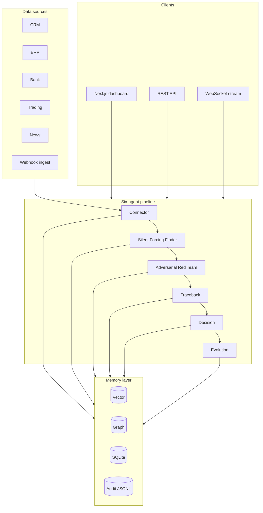

# Fluf37

**Pre-release risk review before you wire** — an auditable multi-agent platform that unifies CRM, ERP, banking, trading, and news, finds cross-source blind spots, stress-tests them adversarially, traces findings through persistent memory, and records every step in a hash-chained audit log.

[](https://github.com/haseeb099/Fluf37/actions/workflows/ci.yml)
[](LICENSE)

**Launch status:** **Pilot ready** (open core v0.9) for design partners on **Pre-Release Risk Review** with synthetic data. Not production SaaS yet — see [What ships today](#what-ships-today).

**Who it's for:** Mid-market CFO offices ($50M–$300M revenue) that approve vendor wires and credit weekly and need explainable cross-source risk review, not another chatbot on top of siloed dashboards.

**Deep dives:** [CTO handoff](docs/CTO_HANDOFF.md) · [Market strategy](docs/MARKET_READY.md) · [Launch readiness](docs/launch-readiness.md)

---

## Why Fluf37

Finance teams run on disconnected systems. CRM says one thing; ERP, banking, and trading say another. Generic copilots summarize each silo in isolation. Dashboards show what you already track — not what you missed.

Fluf37 runs a **fixed six-agent pipeline** over normalized cross-source data. It discovers blind spots, adversarially stress-tests each one, links current signals to named historical failures, produces structured trade and credit recommendations, and logs the full run for audit replay. The default path is **deterministic demo mode** (seeded synthetic data, no vendor keys) so judges, investors, and engineers can evaluate the product in minutes — with optional live LLM for narrative quality.

---

## What it does

| Capability | What you get |
|------------|--------------|
| **Blind-spot detection** | Cross-source gaps surfaced as structured findings (demo: rule-based patterns on synthetic data) |
| **Adversarial stress testing** | Each blind spot attacked before any recommendation is issued |
| **Traceback** | Links current attacks to named historical failures and loss paths (graph + vector memory) |
| **Decisions** | Trade and credit recommendations with outcome feedback |
| **Learning loop** | Evolution agent proposes weight updates — `approval_required`; no auto-apply |
| **Audit trail** | Hash-chained log with `correlation_id` per pipeline run; verify and export APIs |
| **Integrations hub** | Plugin catalog, source connect/sync, HMAC webhook ingest (non-demo) |
| **Risk review export** | JSON export after a completed review on the dashboard |

**Primary workflow:** Connect sources → **Run risk review** → review findings → sign off decisions → replay audit / export report.

---

## How it works

This is an **orchestrated pipeline**, not a single prompt. Six agents run in sequence; each emits schema-validated `AgentEvent`s over WebSocket and writes to shared memory.

```
IDLE → CONNECTING → ANALYZING → ATTACKING → TRACING → DECIDING → EVOLVING → COMPLETE
```

| Agent | Role |
|-------|------|
| **Connector** | Syncs five sources into normalized `SourceData` |
| **Silent Forcing Finder** | Detects blind spots across merged sources |
| **Adversarial Red Team** | Stress-tests each blind spot (attack library + LLM narrative) |
| **Traceback** | Vector search + graph paths to prior failures |
| **Decision** | Trade / credit recommendations; persisted to SQLite |
| **Evolution** | Proposed weight updates; requires explicit approval |

In demo mode, connectors read seeded JSON from `data/demo/`. With `NEXUS_LIVE_LLM=true`, adversarial and traceback agents can call Anthropic, OpenAI, or Groq while still running on synthetic data.

Detail: [agents.md](docs/agents.md) · [architecture.md](docs/architecture.md)

---

## What ships today

Honest inventory. If this table disagrees with marketing copy, **the code wins**.

| Capability | Status | Notes |
|------------|--------|-------|
| Six-agent pipeline + WebSocket streaming | **Shipped** | Demo/pre-live synthetic data |
| Pre-Release Risk Review API | **Shipped** | `POST /api/v1/risk-review/run` |
| Business dashboard (hero CTA, KPIs, findings, export) | **Shipped** | `/` |
| Integrations hub + plugin catalog API | **Shipped** | `/integrations` |
| Traceback graph + timeline | **Shipped** | Named failure nodes |
| Decisions + outcome feedback | **Shipped** | `/decisions` |
| REST API + OpenAPI | **Shipped** | `/docs` |
| Demo synthetic data generator | **Shipped** | Seed 42, deterministic |
| Memory (vector + graph + SQLite) | **Shipped** | In-memory vector fallback without Chroma |
| Hash-chained audit log | **Shipped** | Verify + export endpoints |
| API key + JWT + RBAC + pre-live mode | **Shipped** | `correlation_id` on pipeline runs |
| Hybrid demo data + live LLM | **Shipped** | Groq / Anthropic / OpenAI via `NEXUS_LIVE_LLM` |
| LLM fallback on rate limits | **Shipped** | Canned narrative in demo/pre-live |
| HMAC webhook ingest | **Shipped** | Enforced when demo mode off |
| Connector `data_mode` truth API | **Shipped** | Shows demo vs live per source |
| Live Plaid / Alpaca | **Stub** | Paths exist; empty without credentials |
| Live CRM / ERP / news vendors | **Missing** | Demo JSON only today |
| Connector runtime plugin loader | **Planned** | Catalog API shipped; dynamic loading not yet |
| Multi-tenant DB isolation | **Missing** | Header-scoped orchestrators share memory |
| Prometheus / OpenTelemetry | **Planned** | Placeholder in `backend/observability/` |
| Evolution approval UI | **Planned** | API exists; no dashboard approval flow |
| SSO / SOC2 | **Missing** | Roadmap |

Full matrix: [CTO_HANDOFF.md](docs/CTO_HANDOFF.md) §2 · [launch-readiness.md](docs/launch-readiness.md)

| Stage | Ready? |
|-------|--------|
| Design pilot (synthetic / webhook) | **Yes** |
| Paid pilot | **Conditional** — rotate secrets, pre-live auth profile |
| Beta (live bank) | **No** |
| Production SaaS | **No** |

---

## Architecture



| Layer | Stack |
|-------|-------|
| API | FastAPI, Python 3.11+, Pydantic v2 |
| Frontend | Next.js App Router, TypeScript, Zustand |
| Memory | ChromaDB (optional) or in-memory vector; NetworkX graph; SQLite |
| Streaming | WebSocket `RUN_PIPELINE` → structured `AgentEvent`s |

---

## Quick start

**Prerequisites:** Python **3.11 or 3.12** (recommended; 3.13 works with demo-only `requirements.txt`), Node **20+**.

### Windows

```powershell
cd e:\Fluf37   # or your clone path

if (-not (Test-Path .env)) { Copy-Item .env.example .env }
python -m venv venv
.\venv\Scripts\Activate.ps1
pip install -r requirements.txt
python scripts/generate_demo_data.py --seed 42

# Terminal 1 — backend
.\venv\Scripts\uvicorn.exe backend.main:app --reload --port 8000

# Terminal 2 — frontend
cd frontend
if (-not (Test-Path node_modules)) { npm install }
if (-not (Test-Path .env.local)) { Copy-Item ..\.env.example .env.local }
# Ensure: NEXT_PUBLIC_API_URL=http://localhost:8000
npm run dev
```

### macOS / Linux

```bash
git clone https://github.com/haseeb099/Fluf37.git && cd Fluf37
cp .env.example .env
python -m venv venv && source venv/bin/activate
pip install -r requirements.txt
python scripts/generate_demo_data.py --seed 42
uvicorn backend.main:app --reload --port 8000
```

```bash
cd frontend && npm install && cp ../.env.example .env.local && npm run dev
# Ensure .env.local: NEXT_PUBLIC_API_URL=http://localhost:8000
```

**Helpers:** `.\start_nexus.ps1` or `./start_nexus.sh` (backend bootstrap only).

### Verify it works

| Step | URL / action |
|------|----------------|
| Dashboard | http://localhost:3000 — click **Run risk review** |
| Sidebar | **WS OK** · **LLM LIVE** when `NEXUS_LIVE_LLM=true` |
| Complete run | Pipeline → **COMPLETE** · findings populate · **Export review (JSON)** |
| Integrations | http://localhost:3000/integrations |
| Traceback | Named failures → loss paths (React Flow) |
| Decisions | Loan + trade cards |
| API docs | http://localhost:8000/docs |

```bash
python scripts/verify_setup.py
python scripts/verify_setup.py --pilot   # before customer deploy
pytest tests/ -q                         # 60 tests
```

**API smoke** (analyst role):

```bash
curl -s http://localhost:8000/health
curl -s -X POST http://localhost:8000/api/v1/nexus/run/demo \
  -H "X-Nexus-Key: demo-key" -H "X-Nexus-Role: analyst"
```

**Troubleshooting**

| Symptom | Fix |
|---------|-----|
| **WS disconnected** | Match `NEXT_PUBLIC_API_URL` and `NEXT_PUBLIC_WS_URL` to backend port **8000** in `frontend/.env.local` |
| **Port 8000 in use** | Stop stale uvicorn; restart backend |
| **Groq 429 / rate limit** | Set `NEXUS_LIVE_LLM=false` or rely on `NEXUS_LLM_FALLBACK_ON_ERROR=true` (default) |
| **Connect / Sync blocked** | Connect needs admin JWT; pipeline and sync need analyst role |

---

## Configuration

Essential variables only. Full reference: [configuration.md](docs/configuration.md) · pilot profile: [pilot.env.example](docs/pilot.env.example)

| Variable | Default | Purpose |
|----------|---------|---------|
| `NEXUS_DEMO_MODE` | `true` | Synthetic data + canned LLM |
| `NEXUS_PRE_LIVE_MODE` | `false` | Synthetic pipeline + production-like RBAC |
| `NEXUS_LIVE_LLM` | `false` | Live provider on demo/pre-live data |
| `NEXUS_LLM_FALLBACK_ON_ERROR` | `true` | Canned narrative on 429 in demo/pre-live |
| `LLM_PROVIDER` | `groq` | `anthropic` · `openai` · `groq` |
| `NEXUS_API_KEY` | `demo-key` | `X-Nexus-Key` header |
| `AUTH_MODE` | `jwt_optional` | Use `jwt_required` in staging/prod |
| `NEXUS_WS_REQUIRE_AUTH` | `false` | Require JWT on WebSocket |
| `NEXT_PUBLIC_API_URL` | — | Frontend → backend (must match port) |

Optional: `pip install -r requirements-vector.txt` for ChromaDB on Python 3.11–3.12.

---

## API and UI

### Main API routes

| Method | Path | Role | Purpose |
|--------|------|------|---------|
| POST | `/api/v1/risk-review/run` | analyst | Buyer-facing risk review report |
| POST | `/api/v1/nexus/run/demo` | analyst | Run full pipeline (REST) |
| POST | `/api/v1/connect/{source}` | admin | Connect source |
| POST | `/api/v1/connect/{source}/sync` | analyst | Sync connector |
| GET | `/api/v1/connectors` | authenticated | Per-source `data_mode` |
| GET | `/api/v1/plugins` | authenticated | Plugin catalog |
| GET | `/api/v1/memory/graph` | authenticated | Traceback graph data |
| GET | `/api/v1/audit/verify` | authenticated | Hash chain integrity |
| POST | `/api/v1/auth/token` | — | Issue JWT |
| WS | `/ws/nexus/stream` | optional JWT | `RUN_PIPELINE` + event stream |

Full reference: [api-overview.md](docs/api-overview.md)

### Dashboard routes

| Route | Purpose |
|-------|---------|
| `/` | **Risk review** — hero CTA, first-run checklist, KPIs, findings, JSON export |
| `/integrations` | Plugin hub and source connect (`/connections` redirects here) |
| `/traceback` | Failure → loss paths + timeline |
| `/decisions` | Recommendations and outcome feedback |
| `/agents` | Agent transcript — **advanced only** (`NEXT_PUBLIC_SHOW_ADVANCED=true`) |
| `/evolution` | Weight proposals — **advanced only** |

---

## Security and trust

| Control | Status |
|---------|--------|
| API key (`X-Nexus-Key`) | Shipped |
| JWT + RBAC (`viewer` / `analyst` / `admin`) | Shipped |
| Hash-chained audit log + verify API | Shipped |
| HMAC-signed webhook ingest | Shipped when demo off |
| Pipeline `correlation_id` | Shipped |
| Rate limiting (SlowAPI) | Shipped |

**Not production-ready yet**

- No row-level tenant isolation — orchestrators share memory paths today
- Do **not** trust browser `X-Nexus-Role` in production; set JWT roles at the gateway
- Default secrets in `.env.example` must be rotated before any paid pilot
- No load/pen test characterization for concurrent WebSocket pipelines
- `SECURITY.md` contact email is a placeholder

Before customer deploy: `python scripts/verify_setup.py --pilot` with [pilot.env.example](docs/pilot.env.example).

Detail: [security-compliance.md](docs/security-compliance.md) · [SECURITY.md](SECURITY.md)

---

## Roadmap

### Pilot (now → 8 weeks)

- Design partners on synthetic / HMAC webhook data
- Pre-live auth dress rehearsal (`NEXUS_PRE_LIVE_MODE`, JWT required)
- Dedicated single-tenant deploy; audit export for champion replay

### Beta

- One live vertical validated end-to-end (e.g. Plaid sandbox + demo off)
- Evolution approval UI
- OpenTelemetry on pipeline states
- One read-only CRM or ERP connector

### Production

- Tenant-isolated Postgres + pgvector
- Connector runtime plugin loader
- SSO (OIDC), SOC2-friendly audit sink
- External alerting (currently stub in `backend/services/alerting.py`)

Full roadmap: [roadmap.md](docs/roadmap.md) · GTM: [GTM_LAUNCH.md](docs/GTM_LAUNCH.md) · Pricing: [PRICING.md](docs/PRICING.md)

---

## Testing and CI

```bash
pytest tests/ -q
ruff check backend tests
cd frontend && npm run type-check && npm run lint && npm run build
```

CI: [.github/workflows/ci.yml](.github/workflows/ci.yml)

Demo QA script: [demo_checklist.md](docs/demo_checklist.md)

---

## Deployment

```bash
docker compose up --build
```

Production checklist: [deployment.md](docs/deployment.md)

---

## Contributing

See [CONTRIBUTING.md](CONTRIBUTING.md). Keep demo mode stable; label stubbed features honestly in docs.

## License

MIT — [LICENSE](LICENSE)
