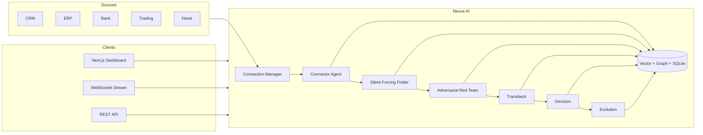

# Nexus AI

**Auditable multi-agent financial intelligence** — unifies CRM, ERP, banking, trading, and news into one pipeline that finds blind spots, stress-tests them adversarially, traces decisions through memory, and learns from outcomes.

[](https://github.com/YOUR_ORG/nexus-ai/actions/workflows/ci.yml) <!-- replace YOUR_ORG with your GitHub org -->
[](LICENSE)

> **Launch status:** **Pilot ready** for design partners on **Pre-Release Risk Review** (synthetic data). GTM: [docs/GTM_LAUNCH.md](docs/GTM_LAUNCH.md) · Pricing: [docs/PRICING.md](docs/PRICING.md)

**For CTO / VP Engineering:** Full technical handoff — architecture, security, risks, priorities, and go/no-go — is in **[docs/CTO_HANDOFF.md](docs/CTO_HANDOFF.md)**.

---

## Test it now (Windows)

**Prerequisites:** Python **3.11 or 3.12** (recommended on Windows; 3.13 works with demo-only `requirements.txt`), Node **20+**.

```powershell
cd e:\Fluf37   # or your clone path

if (-not (Test-Path .env)) { Copy-Item .env.example .env }
python -m venv venv
.\venv\Scripts\Activate.ps1
pip install -r requirements.txt
python scripts/generate_demo_data.py --seed 42

# Terminal 1 — backend
.\venv\Scripts\uvicorn.exe backend.main:app --reload --port 8000

# Terminal 2 — frontend (must use port 8000 in .env.local)
cd frontend
if (-not (Test-Path node_modules)) { npm install }
if (-not (Test-Path .env.local)) { Copy-Item ..\.env.example .env.local }
# Edit frontend/.env.local: NEXT_PUBLIC_API_URL=http://localhost:8000
npm run dev
```

| Step | URL / action |
|------|----------------|
| Dashboard | http://localhost:3000 — **Run risk review** hero CTA |
| Sidebar | **WS OK** · **LLM LIVE** (when `NEXUS_LIVE_LLM=true`) |
| Run risk review | Hero or sidebar → pipeline **COMPLETE** · findings populate |
| Integrations | http://localhost:3000/integrations — plugin hub & source connect |
| Agent activity | http://localhost:3000/agents — live agent stream grid |
| Traceback | Named failure → loss paths (React Flow) + timeline |
| Decisions | Loan + trade cards |
| API docs | http://localhost:8000/docs |

```powershell
python scripts/verify_setup.py
pytest tests/ -q
```

**API smoke** (analyst role required for pipeline):

```powershell
$h = @{ "X-Nexus-Key" = "demo-key"; "X-Nexus-Role" = "analyst" }
Invoke-RestMethod http://localhost:8000/health
Invoke-RestMethod -Method POST http://localhost:8000/api/v1/nexus/run/demo -Headers $h
```

**Docs:** [Demo checklist](docs/demo_checklist.md) · [Launch readiness](docs/launch-readiness.md) · [CTO handoff](docs/CTO_HANDOFF.md) · [Chrome DevTools MCP](docs/mcp-setup.md)

**Troubleshooting**

| Symptom | Fix |
|---------|-----|
| **WS disconnected** | Set `frontend/.env.local` to port **8000** (`NEXT_PUBLIC_API_URL`, `NEXT_PUBLIC_WS_URL`). Restart backend after code pulls. |
| **Port 8000 in use** | Stop the old uvicorn process, then restart: `Get-NetTCPConnection -LocalPort 8000 \| Stop-Process -Id {OwningProcess} -Force` |
| **Red Groq 429 error** | Daily token limit hit. Set `NEXUS_LIVE_LLM=false` for canned mode, wait for reset, or use a smaller `GROQ_MODEL`. With demo data, `NEXUS_LLM_FALLBACK_ON_ERROR=true` (default) completes the review using demo narrative. |
| **Connect / Sync blocked** | Connect needs admin JWT (automatic in UI); pipeline and sync need analyst role. |

---

## Overview

Finance teams run on disconnected systems. Generic copilots summarize silos; they do not **adversarially stress** cross-source assumptions or **chain** prior failures to current signals.

Nexus AI runs a fixed **six-agent pipeline** over normalized `SourceData`, streams structured events over WebSocket, persists decisions and graph memory, and ships **deterministic demo mode** (seeded synthetic data, no API keys) for evaluation and CI.

**Positioning:** *Explainable, simulation-first financial intelligence — not another dashboard chatbot.*

---

## Architecture



| Agent | Role |
|-------|------|
| **Connector** | Syncs sources, merges into `SourceData` |
| **Silent Forcing Finder** | Detects blind spots (demo: rule patterns) |
| **Adversarial Red Team** | Stress-tests each blind spot |
| **Traceback** | Links attacks to named historical failures (graph + vector) |
| **Decision** | Trade / credit recommendations |
| **Evolution** | Proposed weight updates (`approval_required`) |

[architecture.md](docs/architecture.md) · [agents.md](docs/agents.md) · **[CTO_HANDOFF.md](docs/CTO_HANDOFF.md)**

---

## What ships today

| Capability | Status |
|------------|--------|
| Six-agent pipeline + WebSocket streaming | **Shipped** (demo) |
| Business dashboard (hero CTA, KPIs, findings) | **Shipped** |
| Integrations hub + plugin catalog API | **Shipped** |
| REST API, demo data, audit hash chain | **Shipped** |
| JWT + RBAC + pre-live mode + pipeline `correlation_id` | **Shipped** |
| Traceback graph (titles, affected entities) | **Shipped** |
| Connector `data_mode` API | **Shipped** |
| Hybrid demo data + live LLM (Anthropic, OpenAI, **Groq**) | **Shipped** |
| LLM fallback on provider rate limits (demo/pre-live) | **Shipped** |
| Live CRM/ERP/news vendors | **Missing** |
| Live Plaid / Alpaca | **Stub** |
| Multi-tenant DB isolation | **Missing** |

Full matrix: [docs/CTO_HANDOFF.md](docs/CTO_HANDOFF.md) §2 · [launch-readiness.md](docs/launch-readiness.md)

---

## Quick start (macOS / Linux)

```bash
git clone <your-repo-url> nexus-ai && cd nexus-ai
cp .env.example .env
python -m venv venv && source venv/bin/activate
pip install -r requirements.txt
python scripts/generate_demo_data.py --seed 42
uvicorn backend.main:app --reload --port 8000
```

```bash
cd frontend && npm install && npm run dev
# Ensure .env.local: NEXT_PUBLIC_API_URL=http://localhost:8000
```

| URL | Purpose |
|-----|---------|
| http://localhost:3000 | Dashboard |
| http://localhost:8000/docs | OpenAPI |
| http://localhost:8000/health | Liveness |

Helpers: `./start_nexus.sh` or `.\start_nexus.ps1` (backend bootstrap only).

---

## Configuration (essentials)

| Variable | Default | Notes |
|----------|---------|-------|
| `NEXUS_DEMO_MODE` | `true` | Synthetic data + canned LLM |
| `NEXUS_LIVE_LLM` | `false` | Use live provider while demo/pre-live data runs |
| `NEXUS_LLM_FALLBACK_ON_ERROR` | `true` | Fall back to canned LLM on 429/rate limits in demo/pre-live |
| `LLM_PROVIDER` | `anthropic` | `anthropic` · `openai` · **`groq`** |
| `GROQ_API_KEY` / `GROQ_MODEL` | — | Groq OpenAI-compatible API |
| `NEXUS_PRE_LIVE_MODE` | `false` | Demo pipeline + production-like RBAC |
| `NEXUS_API_KEY` | `demo-key` | `X-Nexus-Key` header |
| `AUTH_MODE` | `jwt_optional` | Use `jwt_required` in staging/prod |
| `NEXT_PUBLIC_API_URL` | (frontend) | Must match backend port |

Full list: [configuration.md](docs/configuration.md)

---

## API overview

| Method | Path | Role |
|--------|------|------|
| POST | `/api/v1/nexus/run/demo` | analyst |
| POST | `/api/v1/risk-review/run` | analyst |
| GET | `/api/v1/plugins` | authenticated |
| POST | `/api/v1/plugins/register` | admin |
| GET | `/api/v1/platform/info` | authenticated |
| POST | `/api/v1/connect/{source}/sync` | analyst |
| POST | `/api/v1/connect/{source}` | admin |
| GET | `/api/v1/memory/graph` | authenticated |
| GET | `/api/v1/audit/verify` | authenticated |
| WS | `/ws/nexus/stream` | `RUN_PIPELINE` |

[api-overview.md](docs/api-overview.md)

---

## Testing & CI

```bash
pytest tests/ -q          # 55 tests
ruff check backend tests
cd frontend && npm run type-check && npm run lint && npm run build
```

CI: [.github/workflows/ci.yml](.github/workflows/ci.yml)

---

## Security

API key + JWT + RBAC; hash-chained audit log; HMAC webhooks when not in demo. **Do not trust browser `X-Nexus-Role` in production** — set JWT roles at the gateway.

[security-compliance.md](docs/security-compliance.md) · [SECURITY.md](SECURITY.md)

---

## Deployment

```bash
docker compose up --build
```

[deployment.md](docs/deployment.md)

---

## Documentation

| Document | Audience |
|----------|----------|
| **[CTO_HANDOFF.md](docs/CTO_HANDOFF.md)** | **CTO / leadership — start here** |
| [docs/README.md](docs/README.md) | Full doc index |
| [launch-readiness.md](docs/launch-readiness.md) | Go/no-go verdict |
| [demo_checklist.md](docs/demo_checklist.md) | QA / sales demo |
| [roadmap.md](docs/roadmap.md) | MVP → v1 → scale |
| [CONTRIBUTING.md](CONTRIBUTING.md) | Contributors |

---

## License

MIT — [LICENSE](LICENSE).
