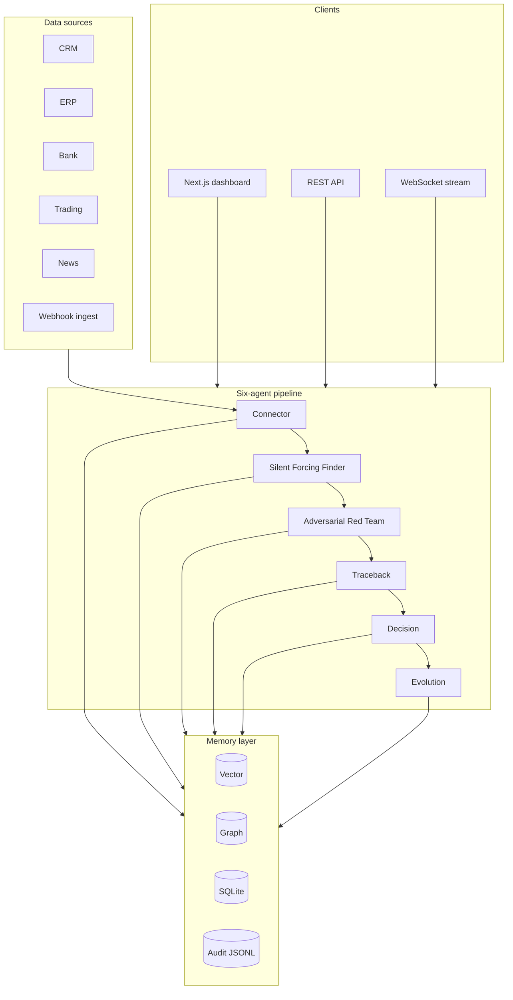

# Fluf37

**Pre-release risk review before you wire** — an auditable multi-agent platform that unifies CRM, ERP, banking, trading, and news, finds cross-source blind spots, stress-tests them adversarially, traces findings through persistent memory, and records every step in a hash-chained audit log.

[](https://github.com/haseeb099/Fluf37/actions/workflows/ci.yml)
[](LICENSE)
[](https://www.python.org/)
[](https://fastapi.tiangolo.com/)
[](https://nextjs.org/)
[](https://www.typescriptlang.org/)

**Move 37 submission** · **Pilot ready** (open core v0.9) · Demo runs in under 2 minutes — no API keys required.

---

## 🌟 Overview

Finance teams don't just need more data — they need **better decisions they can trust**. Fluf37 connects the systems that matter most — CRM, ERP, banking, trading, and news — and turns them into **one auditable intelligence layer**.

It does not stop at summarizing information. It **finds blind spots**, **stress-tests them adversarially**, **traces the decision path through memory**, and **learns from outcomes over time**. That means your team can spot hidden exposure earlier, understand why a risk matters, and defend every decision with a clear audit trail.

If you need a product that helps your finance operation move faster without losing control, **Fluf37 is built for that**.

| What judges should see | Where |
|----------------------|--------|
| One-click risk review (six-agent pipeline, live WebSocket) | http://localhost:3000 → **Run risk review** |
| Cross-source findings + severity | Dashboard findings panel after **COMPLETE** |
| Adversarial + traceback proof | `/traceback` — named failures → loss paths |
| Auditability | Export JSON on dashboard · `GET /api/v1/audit/verify` |
| Honest readiness | [What ships today](#what-ships-today) — demo data labeled clearly |

**2-minute demo path:** Clone → quick start below → **Run risk review** → scroll findings → **Export review (JSON)** → open **Traceback** and **Decisions**.

**Who it's for:** Mid-market CFO offices ($50M–$300M revenue) approving vendor wires and credit weekly — and any team that needs explainable cross-source risk review, not another dashboard chatbot.

**Deep dives:** [CTO handoff](docs/CTO_HANDOFF.md) · [Market strategy](docs/MARKET_READY.md) · [Launch readiness](docs/launch-readiness.md)

---

## ✨ Features

Fluf37 provides a robust set of features designed to empower finance teams with unparalleled insights and control:

| Capability | What you get |
|------------|--------------|
| **Blind-spot detection** | Cross-source gaps surfaced as structured findings (demo: rule-based patterns on synthetic data) |
| **Adversarial stress testing** | Each blind spot attacked before any recommendation is issued |
| **Traceback** | Links current attacks to named historical failures and loss paths (graph + vector memory) |
| **Decisions** | Trade and credit recommendations with outcome feedback |
| **Learning loop** | Evolution agent proposes weight updates — `approval_required`; no auto-apply |
| **Audit trail** | Hash-chained log with `correlation_id` per pipeline run; verify and export APIs |
| **Integrations hub** | Plugin catalog, source connect/sync, HMAC webhook ingest (non-demo) |
| **Risk review export** | JSON export after a completed review on the dashboard |

**Primary workflow:** Connect sources → **Run risk review** → review findings → sign off decisions → replay audit / export report.

---

## 🛠️ Tech Stack

Fluf37 is built with a modern and scalable tech stack, ensuring high performance, reliability, and maintainability.

**Backend:**
*   **Framework:** FastAPI (Python 3.11+)
*   **Data Validation:** Pydantic v2
*   **Logging:** Structlog
*   **Rate Limiting:** SlowAPI
*   **Memory/Database:** ChromaDB (optional), NetworkX (graph), SQLite
*   **LLM Integration:** Custom LLMClient supporting Anthropic, OpenAI, Groq

**Frontend:**
*   **Framework:** Next.js App Router
*   **Language:** TypeScript
*   **State Management:** Zustand

---

## 🚀 Getting Started

**Prerequisites:** Python **3.11 or 3.12** (recommended; 3.13 works with demo-only `requirements.txt`), Node **20+**.

### Windows

```powershell
cd e:\Fluf37   # or your clone path

if (-not (Test-Path .env)) { Copy-Item .env.example .env }
python -m venv venv
.\venv\Scripts\Activate.ps1
pip install -r requirements.txt
python scripts/generate_demo_data.py --seed 42

# Terminal 1 — backend
.\venv\Scripts\uvicorn.exe backend.main:app --reload --port 8000

# Terminal 2 — frontend
cd frontend
if (-not (Test-Path node_modules)) { npm install }
if (-not (Test-Path .env.local)) { Copy-Item ..\.env.example .env.local }
# Ensure: NEXT_PUBLIC_API_URL=http://localhost:8000
npm run dev
```

### macOS / Linux

```bash
git clone https://github.com/haseeb099/Fluf37.git && cd Fluf37
cp .env.example .env
python -m venv venv && source venv/bin/activate
pip install -r requirements.txt
python scripts/generate_demo_data.py --seed 42
uvicorn backend.main:app --reload --port 8000
```

```bash
cd frontend && npm install && cp ../.env.example .env.local && npm run dev
# Ensure .env.local: NEXT_PUBLIC_API_URL=http://localhost:8000
```

**Helpers:** `.\start_nexus.ps1` or `./start_nexus.sh` (backend bootstrap only).

### Verify it works

| Step | URL / action |
|------|----------------|
| Dashboard | http://localhost:3000 — click **Run risk review** |
| Sidebar | **WS OK** · **LLM LIVE** when `NEXUS_LIVE_LLM=true` |
| Complete run | Pipeline → **COMPLETE** · findings populate · **Export review (JSON)** |
| Integrations | http://localhost:3000/integrations |
| Traceback | Named failures → loss paths (React Flow) |
| Decisions | Loan + trade cards |
| API docs | http://localhost:8000/docs |

```bash
python scripts/verify_setup.py
python scripts/verify_setup.py --pilot   # before customer deploy
pytest tests/ -q                         # 60 tests
```

**API smoke** (analyst role):

```bash
curl -s http://localhost:8000/health
curl -s -X POST http://localhost:8000/api/v1/nexus/run/demo \
  -H "X-Nexus-Key: demo-key" -H "X-Nexus-Role: analyst"
```

**Troubleshooting**

| Symptom | Fix |
|---------|-----|
| **WS disconnected** | Match `NEXT_PUBLIC_API_URL` and `NEXT_PUBLIC_WS_URL` to backend port **8000** in `frontend/.env.local` |
| **Port 8000 in use** | Stop stale uvicorn; restart backend |
| **Groq 429 / rate limit** | Set `NEXUS_LIVE_LLM=false` or rely on `NEXUS_LLM_FALLBACK_ON_ERROR=true` (default) |
| **Connect / Sync blocked** | Connect needs admin JWT; pipeline and sync need analyst role |

---

## 🏗️ Architecture

Fluf37 operates on an **orchestrated pipeline** of six agents, designed for robust and auditable decision-making. Each agent runs in sequence, emitting schema-validated `AgentEvent`s over WebSocket and writing to shared memory.



| Agent | Role |
|-------|------|
| **Connector** | Syncs five sources into normalized `SourceData` |
| **Silent Forcing Finder** | Detects blind spots across merged sources |
| **Adversarial Red Team** | Stress-tests each blind spot (attack library + LLM narrative) |
| **Traceback** | Vector search + graph paths to prior failures |
| **Decision** | Trade / credit recommendations; persisted to SQLite |
| **Evolution** | Proposed weight updates; requires explicit approval |

---

## 🔒 Security and Trust

Fluf37 is designed with security and auditability at its core, providing transparency and control over financial risk reviews.

| Control | Status |
|---------|--------|
| API key (`X-Nexus-Key`) | Shipped |
| JWT + RBAC (`viewer` / `analyst` / `admin`) | Shipped |
| Hash-chained audit log + verify API | Shipped |
| HMAC-signed webhook ingest | Shipped when demo off |
| Pipeline `correlation_id` | Shipped |
| Rate limiting (SlowAPI) | Shipped |

**Important Security Notes:**
*   No row-level tenant isolation; orchestrators currently share memory paths.
*   Do **not** trust browser `X-Nexus-Role` in production; set JWT roles at the gateway.
*   Default secrets in `.env.example` must be rotated before any paid pilot.
*   No load/penetration test characterization for concurrent WebSocket pipelines.
*   `SECURITY.md` contact email is a placeholder.

Before customer deploy: `python scripts/verify_setup.py --pilot` with [pilot.env.example](docs/pilot.env.example).

Detail: [security-compliance.md](docs/security-compliance.md)

---

## 🤝 Contributing

We welcome contributions to Fluf37! Please see `CONTRIBUTING.md` for guidelines on how to get started.

---

## 📄 License

This project is licensed under the MIT License - see the [LICENSE](LICENSE) file for details.

---

## 📞 Contact

For any inquiries or support, please reach out to Muhammad Haseeb Rafique.

---

*Built with 💖 by Muhammad Haseeb Rafique*