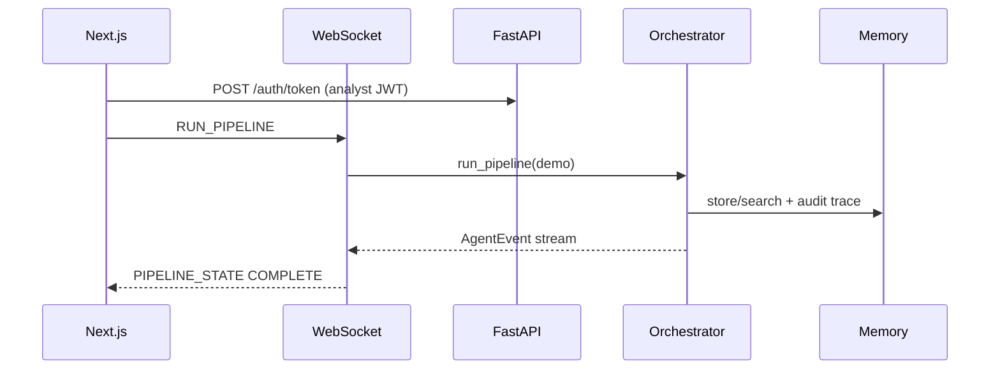

# Nexus AI — CTO handoff document

**Version:** open core v0.9.1  
**Last updated:** June 2026  
**Audience:** CTO, VP Engineering, security review, design partners  
**Verdict:** **Pilot ready** — sell 8-week design pilots on Pre-Release Risk Review (synthetic data). Hybrid **demo data + live LLM** (Groq/Anthropic/OpenAI) is supported for narrative evaluation. Not production ready without live integrations, gateway RBAC, and tenant isolation.

**GTM wedge:** Mid-market CFO office — [GTM_LAUNCH.md](GTM_LAUNCH.md) | [PRICING.md](PRICING.md)

This is the single handoff for technical leadership. The [README](../README.md) is the developer front door; this document is the full operational and architectural picture.

---

## 1. Executive summary

Nexus AI is an **auditable multi-agent financial intelligence platform**. It ingests normalized data from CRM, ERP, banking, trading, and news; runs a **fixed six-agent pipeline** (not a single chat prompt); stress-tests findings adversarially; traces decisions through **vector, graph, and SQLite memory**; and records an **append-only hash-chained audit log**.

**What works today:** A deterministic **demo mode** (seeded synthetic data, rule-based blind spots, canned LLM streams) with a **business-grade Next.js dashboard** (hero risk-review CTA, KPIs, findings), **Integrations hub** (plugin catalog + community registration), WebSocket streaming via a shared provider, REST API, JWT/RBAC, pipeline audit tracing, **live LLM via Groq/Anthropic/OpenAI** with automatic fallback on rate limits, and **55 automated backend tests** plus frontend CI build.

**What does not work as production yet:** Live vendor APIs (CRM/ERP/news), production-hardened multi-tenant storage, observability (OTel), and enterprise SSO. Plaid/Alpaca paths exist as **stubs** behind feature flags.

**Differentiation (code-backed):**

1. Simulation before action — adversarial pass per blind spot before decisions.  
2. Traceable memory — graph/traceback links current attacks to named historical failures and loss events.  
3. Auditable pipeline — structured `AgentEvent` stream + `correlation_id` + hash-chained `data/audit.jsonl`.

---

## 2. Capability truth table

| Capability | Status | Evidence |
|------------|--------|----------|
| Six-agent orchestrated pipeline | **Shipped** (demo) | `backend/agents/orchestrator.py`, `tests/test_pipeline_e2e.py` |
| WebSocket `RUN_PIPELINE` | **Shipped** | `backend/main.py`, `tests/test_websocket.py` |
| REST API (sources, decisions, memory, evolution, audit) | **Shipped** | `backend/routers/*`, OpenAPI `/docs` |
| Demo synthetic data | **Shipped** | `scripts/generate_demo_data.py`, `data/demo/*` |
| In-memory vector (demo) / Chroma (optional) | **Shipped** | `backend/memory/vector.py`, `requirements-vector.txt` |
| NetworkX graph + SQLite decisions | **Shipped** | `backend/memory/graph.py`, `timeseries.py` |
| Traceback graph (human-readable nodes) | **Shipped** | `backend/memory/demo_graph.py`, Traceback UI |
| API key + JWT + RBAC | **Shipped** | `backend/auth/*`, `tests/test_rbac.py` |
| Pre-live mode (demo data + strict RBAC) | **Shipped** | `NEXUS_PRE_LIVE_MODE`, `docs/security-compliance.md` |
| Pipeline audit trace | **Shipped** | `backend/utils/pipeline_trace.py`, `/api/v1/audit/recent` |
| Pre-Release Risk Review API | **Shipped** | `POST /api/v1/risk-review/run`, `backend/services/risk_review.py` |
| Platform deployment truth | **Shipped** | `GET /api/v1/platform/info`, `docs/GTM_LAUNCH.md` |
| Connector capability API | **Shipped** | `GET /api/v1/connectors` → `data_mode` per source |
| Plugin catalog + registration API | **Shipped** | `GET/POST/DELETE /api/v1/plugins`, `backend/services/plugin_catalog.py` |
| Integrations hub UI | **Shipped** | `/integrations` — official + community plugins |
| Business dashboard (Overview) | **Shipped** | Hero CTA, KPIs, workflow, findings; agent grid on `/agents` |
| Shared WebSocket provider | **Shipped** | `NexusWebSocketProvider` — single WS for sidebar + hero |
| Live LLM (Anthropic / OpenAI / Groq) | **Shipped** | `backend/utils/llm_client.py`, `NEXUS_LIVE_LLM` hybrid flag |
| LLM fallback on rate limits | **Shipped** | `NEXUS_LLM_FALLBACK_ON_ERROR` → canned narrative in demo/pre-live |
| HMAC webhook ingest | **Shipped** (non-demo) | `backend/routers/ingest.py` |
| SlowAPI rate limits | **Shipped** | Relaxed when demo/pre-live |
| Live Salesforce / HubSpot / NetSuite / NewsAPI | **Missing** | Connectors return empty when demo off |
| Live Plaid / Alpaca | **Stub** | `backend/connectors/live/*` |
| Connector runtime plugin loader | **Planned** | Catalog API shipped; dynamic agent loading not yet |
| Per-tenant DB isolation | **Missing** | Header-scoped orchestrators share memory paths |
| Prometheus / OTel | **Planned** | `backend/observability/` placeholder |
| Redis (docker-compose) | **Optional** | Not used by application code |

**Rule for the org:** If marketing or README disagrees with this table, **this table and the code win**.

---

## 3. Architecture

### 3.1 Runtime components

| Layer | Technology | Location |
|-------|------------|----------|
| API | FastAPI 0.111, Python 3.11+ | `backend/main.py` |
| Orchestration | asyncio, sequential agents | `backend/agents/orchestrator.py` |
| Schemas | Pydantic v2 | `backend/schemas/models.py` |
| Frontend | Next.js App Router, TypeScript | `frontend/src/` |
| Vector memory | ChromaDB (optional) or in-memory | `backend/memory/vector.py` |
| Graph memory | NetworkX → `data/graph.json` | `backend/memory/graph.py` |
| Time-series | SQLite → `data/nexus.db` | `backend/memory/timeseries.py` |
| Audit | JSONL hash chain → `data/audit.jsonl` | `backend/utils/audit_log.py` |

### 3.2 Six-agent pipeline

States: `IDLE` → `CONNECTING` → `ANALYZING` → `ATTACKING` → `TRACING` → `DECIDING` → `EVOLVING` → `COMPLETE` (or `ERROR`).

| Agent | Input | Output | Demo behavior |
|-------|-------|--------|-------------|
| Connector | — | `ConnectorOutput` | Syncs 5 sources from `data/demo/*.json` |
| Silent Forcing Finder | `SourceData` | `BlindSpotOutput` | Rule-based patterns (≥3 blind spots typical) |
| Adversarial Red Team | `BlindSpotOutput` | `AttackOutput` | Attack library + one batch LLM narrative |
| Traceback | `AttackOutput` | `TracebackOutput` | Vector search + graph paths with titles |
| Decision | `AllSignals` | Trade/loan recommendations | Deterministic rules; SQLite persist |
| Evolution | `EvolutionInput` | `EvolutionReport` | `approval_required=true` (no auto-apply) |

Detail: [agents.md](agents.md), [architecture.md](architecture.md).

### 3.3 Repository layout

```
backend/           # FastAPI app, agents, connectors, auth, memory, plugins
frontend/          # Next.js dashboard (App Router, shared UI primitives)
tests/             # 55 pytest tests (auth, pipeline, websocket, plugins, …)
scripts/           # generate_demo_data.py, verify_setup.py
data/              # demo JSON, graph.json, nexus.db, audit.jsonl, plugins/ (runtime)
docs/              # Architecture, security, this handoff
.github/workflows/ # CI: ruff, pytest, frontend build
```

### 3.4 Data flow (demo)



---

## 4. Environment modes

| Mode | Flags | Data | LLM | Use case |
|------|-------|------|-----|----------|
| **Demo** | `NEXUS_DEMO_MODE=true` | Synthetic seed 42 | Canned (default) | Sales, judges, CI |
| **Demo + live LLM** | `NEXUS_DEMO_MODE=true`, `NEXUS_LIVE_LLM=true` | Synthetic | Groq / Anthropic / OpenAI | Pilot narrative eval |
| **Pre-live** | `NEXUS_PRE_LIVE_MODE=true` | Same synthetic pipeline | Canned or live | Dress rehearsal before prod |
| **Staging** | `NEXUS_DEMO_MODE=false` | Sandbox vendors (when built) | Live keys required | Integration QA |
| **Production** | Demo off | Live connectors | Live keys required | Pilot customers |

**Critical:** `uses_demo_pipeline()` = demo OR pre-live. Both use synthetic data. Canned LLM is the default; set `NEXUS_LIVE_LLM=true` plus provider keys for hybrid mode.

**LLM providers:** `LLM_PROVIDER` = `anthropic` | `openai` | `groq`. Groq uses OpenAI-compatible API (`GROQ_API_KEY`, `GROQ_MODEL`, `GROQ_BASE_URL`).

**Rate limits:** When demo/pre-live and `NEXUS_LLM_FALLBACK_ON_ERROR=true` (default), provider 429 errors fall back to canned agent narrative so the pipeline still reaches `COMPLETE`. Adversarial and traceback use **one batch LLM call** each to conserve tokens.

**Frontend URLs:** `frontend/.env.local` must match backend port:

```
NEXT_PUBLIC_API_URL=http://localhost:8000
NEXT_PUBLIC_WS_URL=ws://localhost:8000/ws/nexus/stream
```

A mismatch (e.g. 8080 vs 8000) causes WebSocket disconnect and 404 on `/auth/token`.

---

## 5. Security and compliance posture

### 5.1 Authentication

- **API key:** `X-Nexus-Key` vs `NEXUS_API_KEY` on protected routes.  
- **JWT:** `POST /api/v1/auth/token` → `Authorization: Bearer`.  
- **Modes:** `AUTH_MODE` = `api_key_only` | `jwt_optional` | `jwt_required`.

### 5.2 Authorization (RBAC)

| Role | Capabilities |
|------|----------------|
| `viewer` | Read sources, decisions, memory, audit verify |
| `analyst` | Run pipeline (REST/WS), sync connectors, audit tail |
| `admin` | Connect/disconnect, audit export |

**Trust boundary:** `X-Nexus-Role` is honored only when `trust_client_role()` is true (demo + `NEXUS_TRUST_CLIENT_ROLE`). In pre-live and production-like modes, API-key callers are **viewers**; elevation requires admin JWT at token issuance.

### 5.3 Audit and traceability

- LLM usage logged to `data/audit.jsonl`.  
- Pipeline events: `pipeline_start`, `pipeline_state`, `agent_complete`, `pipeline_complete`.  
- `correlation_id` on `PIPELINE_STATE` WebSocket/REST responses.  
- Verify: `GET /api/v1/audit/verify`; export: admin only.

Full control matrix: [security-compliance.md](security-compliance.md).

### 5.4 Known security gaps (v0.9)

- No row-level tenant isolation in databases.  
- Client-supplied tenant/role headers must not be trusted at the edge in production.  
- `JWT_SECRET` and demo ingest secrets are placeholders in `.env.example`.  
- No load/pen test characterization for concurrent WebSocket pipelines.  
- `SECURITY.md` contact email is a placeholder.

---

## 6. Operations — run, test, deploy

### 6.1 Local run (minimum)

```bash
cp .env.example .env
python -m venv venv && source venv/bin/activate  # Windows: venv\Scripts\activate
pip install -r requirements.txt
pip install -r requirements-vector.txt   # optional; Chroma on Py 3.11–3.12
python scripts/generate_demo_data.py --seed 42
python scripts/verify_setup.py
uvicorn backend.main:app --reload --port 8000
# second terminal:
cd frontend && npm install && npm run dev
```

Open http://localhost:3000 — sidebar **WS OK** → hero **Run risk review** → **COMPLETE** (7 findings typical).

**Auth in demo:** API key; optional `X-Nexus-Role` if `NEXUS_TRUST_CLIENT_ROLE=true`. Pre-live and production-like modes require JWT roles at token issuance.

### 6.2 Verification commands

```bash
pytest tests/ -q                                    # 55 tests
ruff check backend tests
cd frontend && npm run type-check && npm run lint && npm run build
```

```bash
curl -s http://localhost:8000/health
curl -s -X POST http://localhost:8000/api/v1/nexus/run/demo \
  -H "X-Nexus-Key: demo-key" -H "X-Nexus-Role: analyst"
```

### 6.3 CI/CD

- Workflow: [.github/workflows/ci.yml](../.github/workflows/ci.yml)  
- On push/PR: `requirements.txt` + `requirements-vector.txt`, demo data seed, ruff, pytest, frontend type-check/lint/build.

### 6.4 Docker

```bash
docker compose up --build
```

Images: `Dockerfile.api`, `frontend/Dockerfile`. Redis service is profile `prod` and **unused** by app code.

Production checklist: [deployment.md](deployment.md).

---

## 7. UI product surface

| Route | Purpose |
|-------|---------|
| `/` | **Overview** — hero risk-review CTA, KPIs, platform status, workflow, findings |
| `/integrations` | Plugin hub — official connectors + community registration (`/connections` redirects here) |
| `/agents` | Agent activity grid — live streamed narratives per agent |
| `/traceback` | React Flow: named failures → realized losses + timeline |
| `/decisions` | Loan + trade cards, outcome feedback |
| `/evolution` | WoW score, proposed rules (approval gate) |

**Key frontend modules:** `RiskReviewHero`, `NexusWebSocketProvider` (single WS connection), `IntegrationsHub`, shared UI primitives under `frontend/src/components/ui/`.

Demo acceptance: [demo_checklist.md](demo_checklist.md).

---

## 8. Integrations and plugins

### 8.1 Data sources

| Source | Demo | Live today | Notes |
|--------|------|------------|-------|
| CRM | `data/demo/crm_data.json` | Empty if not demo | `GET /connectors` → `data_mode` |
| ERP | `data/demo/erp_data.json` | Empty | |
| Bank | `data/demo/bank_data.json` | Plaid stub | `NEXUS_ENABLE_BANK` |
| Trading | `data/demo/trading_data.json` | Alpaca stub | `NEXUS_ENABLE_TRADING` |
| News | `data/demo/news_data.json` | Demo only | |
| Webhook | — | `POST /ingest/{source}` | HMAC when not demo |

### 8.2 Plugin catalog API

| Method | Path | Role | Notes |
|--------|------|------|-------|
| GET | `/api/v1/plugins` | authenticated | Official + community plugins; filter by category/installed |
| GET | `/api/v1/plugins/{id}` | authenticated | Single manifest |
| POST | `/api/v1/plugins/register` | admin | Community plugin registration → `data/plugins/registered.json` |
| DELETE | `/api/v1/plugins/{id}` | admin | Community plugins only |

Seven official plugins ship in `backend/services/plugin_catalog.py`. Community plugins persist to disk and merge into the catalog at runtime.

Detail: [CONNECTORS.md](CONNECTORS.md).

---

## 9. Testing summary

| Area | Test file(s) |
|------|----------------|
| Full pipeline | `test_pipeline_e2e.py` |
| REST demo run | `test_nexus_run_demo.py` (analyst role) |
| WebSocket | `test_websocket.py` |
| Auth / RBAC / pre-live | `test_auth.py`, `test_rbac.py` |
| Audit chain | `test_audit.py` |
| Pipeline audit trace | `test_pipeline_trace.py` |
| Demo graph labels | `test_demo_graph.py` |
| Connectors / ingest / rate limit | `test_connectors.py`, `test_ingest.py`, `test_rate_limit.py` |
| Plugin catalog | `test_plugins.py` |
| LLM hybrid / Groq config | `test_llm_connectors.py` |
| Prompt context | `test_prompt_context.py` |

---

## 10. Technical debt and risks

| Risk | Impact | Mitigation path |
|------|--------|----------------|
| Groq / LLM daily rate limits | Pipeline errors or fallback narrative | `NEXUS_LLM_FALLBACK_ON_ERROR`; smaller model; budget alerts |
| Shared `MemoryLayer` across tenants | Cross-tenant data bleed | Per-tenant DB + vector store (Scale phase) |
| Stale backend process on dev machines | 404 on new routes, WS failures, port 8000 bind errors | Kill old uvicorn; document restart; health shows `version` |
| Python 3.13 on Windows | `pip install` may fail without vector split | Use 3.11–3.12 or demo-only `requirements.txt` |
| `X-Nexus-Role` in browser | Role spoofing if trusted in prod | Gateway sets JWT claims; `NEXUS_PRE_LIVE_MODE` rehearsal |
| Live connectors empty | False sense of “connected” | `data_mode` + `message` on connection status |
| Evolution weights | Auto-apply could be dangerous | `approval_required=true`; no approval UI yet |
| No OTel/metrics | Blind operations | v1 observability sprint |

---

## 11. Recommended priorities (CTO)

### P0 — Before any paid pilot

1. Enforce `AUTH_MODE=jwt_required` + `NEXUS_WS_REQUIRE_AUTH=true` in staging.  
2. Rotate all secrets; replace `SECURITY.md` contact.  
3. Gateway-terminated TLS; map IdP groups → JWT `role` (never trust `X-Nexus-Role` from browser).  
4. Persistent volumes for `data/*` in K8s/Docker.  
5. Validate one live vertical (e.g. Plaid sandbox + demo off) with integration tests.

### P1 — Beta credibility

1. One live CRM or ERP read-only connector.  
2. Evolution approval UI.  
3. OpenTelemetry on pipeline states and agent latency.  
4. Load test WebSocket concurrent pipelines.  
5. LLM cost/rate-limit guardrails (token budgets per pipeline run).

### P2 — Scale

1. Tenant-isolated Postgres + pgvector.  
2. Connector runtime plugin loader (catalog API exists).  
3. External audit sink (immutable S3 / SIEM).

Roadmap detail: [roadmap.md](roadmap.md).

---

## 12. Documentation index

| Document | Use when |
|----------|----------|
| [README.md](../README.md) | Developer quick start |
| [architecture.md](architecture.md) | System design deep dive |
| [agents.md](agents.md) | Per-agent contracts |
| [api-overview.md](api-overview.md) | REST/WS reference |
| [configuration.md](configuration.md) | Env vars |
| [security-compliance.md](security-compliance.md) | Security review |
| [launch-readiness.md](launch-readiness.md) | Go/no-go matrix |
| [deployment.md](deployment.md) | Docker/production |
| [demo_checklist.md](demo_checklist.md) | QA / demo script |
| [PRD.md](PRD.md) / [TRD.md](TRD.md) | Product/engineering specs |
| [CONTRIBUTING.md](../CONTRIBUTING.md) | Contributor workflow |

---

## 13. Handoff checklist for incoming leadership

- [ ] Clone repo; run `scripts/verify_setup.py` and `pytest tests/ -q` (55 tests)  
- [ ] Run demo UI end-to-end: hero **Run risk review** → COMPLETE → `/integrations` → `/agents`  
- [ ] If using live Groq: confirm `LLM_PROVIDER=groq`, `NEXUS_LIVE_LLM=true`, and understand fallback on 429  
- [ ] Read `security-compliance.md` and confirm prod auth plan  
- [ ] Replace `YOUR_ORG` in README CI badge and `SECURITY.md` email  
- [ ] Confirm `frontend/.env.local` API/WS URLs match deployed backend port (**8000**)  
- [ ] Review [launch-readiness.md](launch-readiness.md) verdict with GTM (demo vs beta)  
- [ ] Assign owner for first live connector + staging environment  

---

## 14. Contact and ownership

| Item | Location |
|------|----------|
| Security reporting | [SECURITY.md](../SECURITY.md) (update email before public launch) |
| License | MIT — [LICENSE](../LICENSE) |
| CI status | `.github/workflows/ci.yml` |

**Maintainer note:** Code is the source of truth. Update this handoff when capability status or verdict changes.
