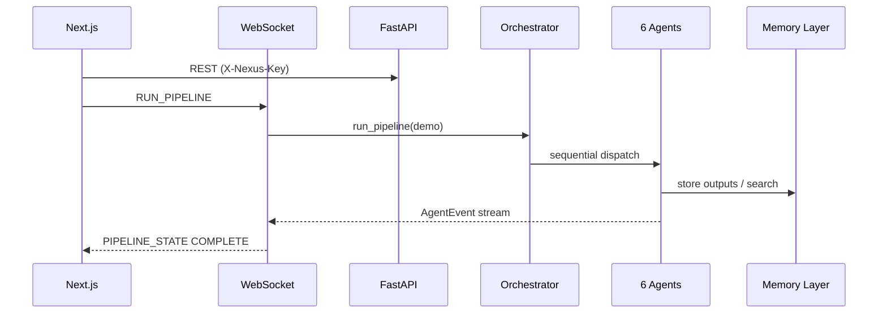
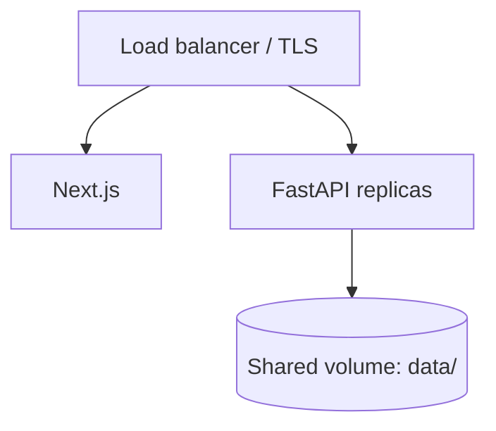

# Architecture

## System context

Nexus AI is a **FastAPI** backend plus **Next.js** frontend. The backend owns agent orchestration, connector normalization, three memory layers, and structured audit logging. The frontend consumes REST and a single WebSocket for pipeline streaming.

## Request paths



## Orchestrator

`NexusOrchestrator` (`backend/agents/orchestrator.py`) holds one instance per tenant id (default `default`). Pipeline states:

`IDLE` → `CONNECTING` → `ANALYZING` → `ATTACKING` → `TRACING` → `DECIDING` → `EVOLVING` → `COMPLETE` (or `ERROR`).

Each agent implements `BaseAgent.run()` and yields `AgentEvent` types: `AGENT_START`, `AGENT_STREAM`, `AGENT_COMPLETE`, `AGENT_ERROR`.

## Integration layer

| Component | Path | Role |
|-----------|------|------|
| `ConnectorRegistry` | `backend/integration/registry.py` | Maps `source_type` → connector class |
| `ConnectionManager` | `backend/integration/connection_manager.py` | connect / sync / status per tenant |
| `CredentialStore` | `backend/integration/credential_store.py` | In-memory credentials (production: replace with vault) |
| `normalizer` | `backend/integration/normalizer.py` | Partial merge into `SourceData` |

## Memory layer

`MemoryLayer` (`backend/memory/layer.py`):

- **Vector** — ChromaDB + sentence-transformers (offline embeddings in demo)
- **Graph** — NetworkX persisted to `GRAPH_DB_PATH`
- **Time-series** — SQLite (`SQLITE_PATH`) for decisions and evolution cycles

**Known limitation:** `get_orchestrator(tenant_id)` instances share a single global `MemoryLayer` (`get_memory()`). Vector/graph keys are not tenant-namespaced in v0.9; full isolation is a Scale-phase item (Postgres + per-tenant pgvector).

## Auth model (v0.9)

- REST: `X-Nexus-Key` or `Authorization: Bearer` JWT (`AUTH_MODE`, default `jwt_optional`)
- Token: `POST /api/v1/auth/token` with valid API key
- Tenant: `X-Nexus-Tenant-Id` or JWT `sub` claim
- RBAC: JWT `role` claim or `X-Nexus-Role` (default **viewer**); admin routes require `admin`
- WebSocket: optional `?token=` or `AUTH` message; enforced when `NEXUS_WS_REQUIRE_AUTH=true`

## Observability

- **structlog** JSON-friendly logs across agents and connectors
- `backend/observability/` — placeholder for OpenTelemetry
- `backend/services/alerting.py` — hook for external alerting

## Data directories

```
data/
  demo/          # Generated JSON (gitignored or committed per policy)
  chroma/        # Vector index
  graph.json     # NetworkX export
  nexus.db       # SQLite
  audit.jsonl    # Hash-chained audit
```

## Frontend

- App Router pages: dashboard, agents, connections, decisions, traceback, evolution
- `useNexusWebSocket` — reconnect with exponential backoff
- `zustand` store normalizes `AgentEvent` stream

## Deployment topology (reference)



Redis in `docker-compose.yml` is optional (`profiles: [prod]`) and **not required** by the current application code.
